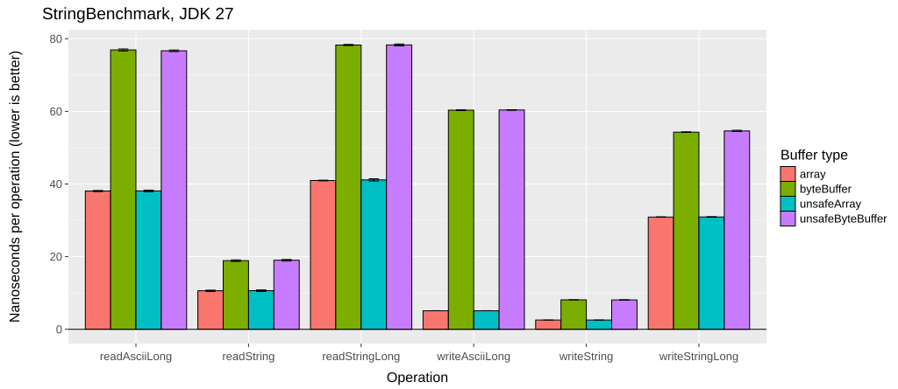
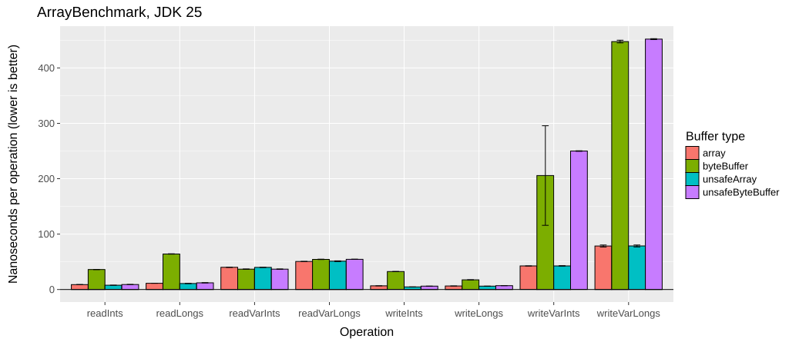
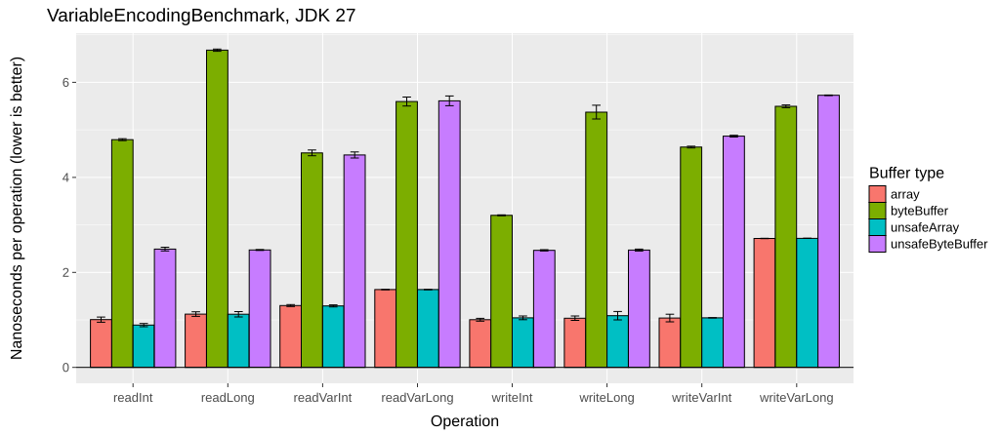
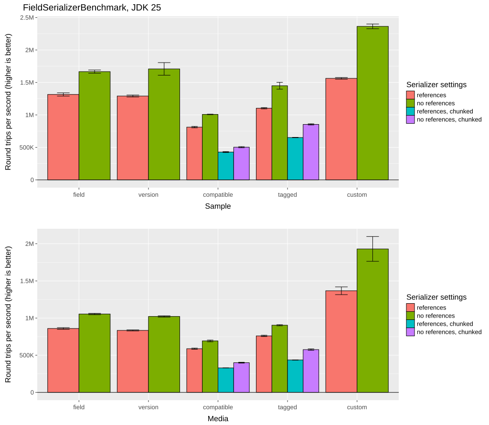
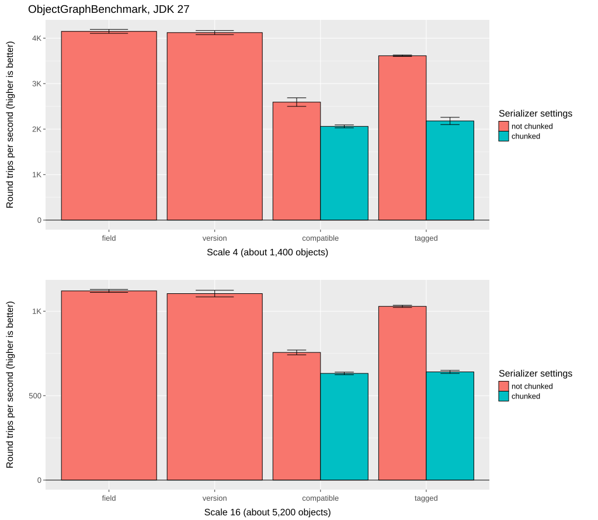
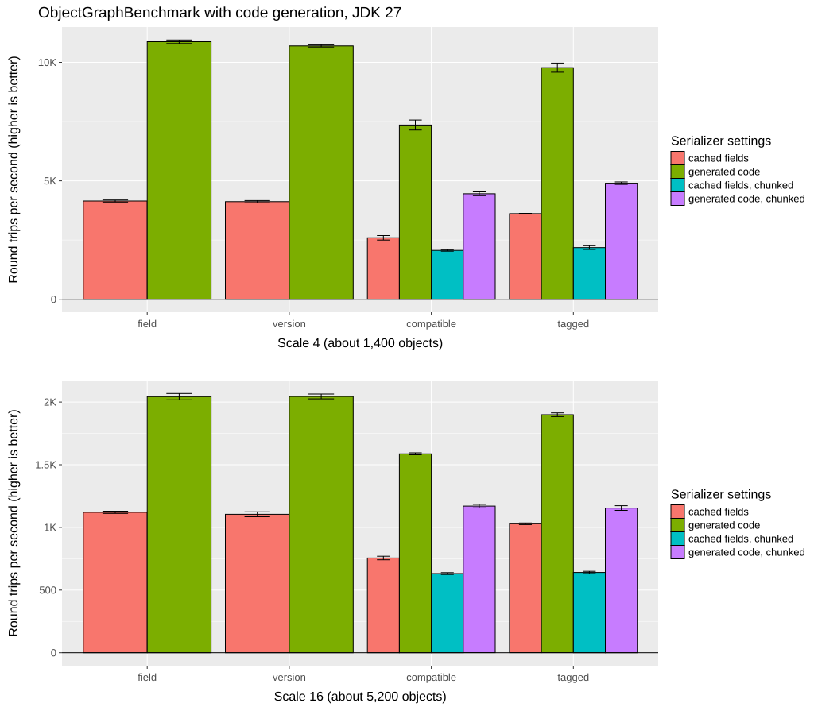

[](https://github.com/EsotericSoftware/kryo/actions/workflows/ci-workflow.yml)
[](https://central.sonatype.com/artifact/com.esotericsoftware/kryo)
[](https://gitter.im/EsotericSoftware/kryo)
[](https://introspector.oss-fuzz.com/project-profile?project=kryo)

Kryo is a fast and efficient binary object graph serialization framework for Java. The goals of the project are high speed, low size, and an easy to use API. The project is useful any time objects need to be persisted, whether to a file, database, or over the network.

Kryo can also perform automatic deep and shallow copying/cloning. This is direct copying from object to object, not object to bytes to object.

This documentation is for Kryo version 6.x. See the [kryo-5 branch](https://github.com/EsotericSoftware/kryo/blob/kryo-5/README.md) for version 5.x and [the Wiki](https://github.com/EsotericSoftware/kryo/wiki/Kryo-v4) for version 4.x.

## Contact / Mailing list

Please use the [Kryo mailing list](https://groups.google.com/forum/#!forum/kryo-users) for questions, discussions, and support. Please limit use of the Kryo issue tracker to bugs and enhancements, not questions, discussions, or support.

## Sponsors

Kryo maintenance and development is sponsored by the [Gecko fund](https://geckofund.org/), which is powered by EXANTE.

## Table of contents

- [Recent releases](#recent-releases)
- [Installation](#installation)
   * [With Maven](#with-maven)
   * [Without Maven](#without-maven)
   * [Building from source](#building-from-source)
   * [Development](#development)
- [Quickstart](#quickstart)
- [IO](#io)
   * [Output](#output)
   * [Input](#input)
   * [Limiting deserialized size](#limiting-deserialized-size)
   * [ByteBuffers](#bytebuffers)
   * [Unsafe buffers](#unsafe-buffers)
   * [Variable length encoding](#variable-length-encoding)
   * [Chunked encoding](#chunked-encoding)
   * [Buffer performance](#buffer-performance)
- [Reading and writing objects](#reading-and-writing-objects)
   * [Round trip](#round-trip)
   * [Deep and shallow copies](#deep-and-shallow-copies)
   * [References](#references)
      + [ReferenceResolver](#referenceresolver)
      + [Reference limits](#reference-limits)
   * [Context](#context)
   * [Reset](#reset)
- [Serializer framework](#serializer-framework)
   * [Registration](#registration)
      + [ClassResolver](#classresolver)
      + [Optional registration](#optional-registration)
   * [Default serializers](#default-serializers)
      + [Built-in default serializers](#built-in-default-serializers)
      + [Serializer factories](#serializer-factories)
   * [Object creation](#object-creation)
      + [InstantiatorStrategy](#instantiatorstrategy)
      + [Overriding create](#overriding-create)
   * [Final classes](#final-classes)
   * [Closures](#closures)
   * [Compression and encryption](#compression-and-encryption)
- [Implementing a serializer](#implementing-a-serializer)
   * [Serializer references](#serializer-references)
      + [Nested serializers](#nested-serializers)
      + [KryoException](#kryoexception)
      + [Stack size](#stack-size)
   * [Accepting null](#accepting-null)
   * [Generics](#generics)
   * [KryoSerializable](#kryoserializable)
   * [Serializer copying](#serializer-copying)
      + [KryoCopyable](#kryocopyable)
      + [Immutable serializers](#immutable-serializers)
- [Kryo versioning and upgrading](#kryo-versioning-and-upgrading)
- [Interoperability](#interoperability)
- [Compatibility](#compatibility)
   * [Replacing a class](#replacing-a-class)
- [Serializers](#serializers)
   * [FieldSerializer](#fieldserializer)
      + [FieldSerializer settings](#fieldserializer-settings)
      + [CachedField settings](#cachedfield-settings)
      + [FieldSerializer annotations](#fieldserializer-annotations)
   * [VersionFieldSerializer](#versionfieldserializer)
      + [VersionFieldSerializer settings](#versionfieldserializer-settings)
   * [TaggedFieldSerializer](#taggedfieldserializer)
      + [TaggedFieldSerializer settings](#taggedfieldserializer-settings)
   * [CompatibleFieldSerializer](#compatiblefieldserializer)
      + [CompatibleFieldSerializer settings](#compatiblefieldserializer-settings)
   * [BeanSerializer](#beanserializer)
   * [Records](#records)
   * [CollectionSerializer](#collectionserializer)
      + [CollectionSerializer settings](#collectionserializer-settings)
   * [MapSerializer](#mapserializer)
      + [MapSerializer settings](#mapserializer-settings)
      + [LinkedHashMap with access order](#linkedhashmap-with-access-order)
   * [Unmodifiable and synchronized collections](#unmodifiable-and-synchronized-collections)
   * [JavaSerializer and ExternalizableSerializer](#javaserializer-and-externalizableserializer)
- [Logging](#logging)
- [GraalVM native image](#graalvm-native-image)
- [JDK AOT cache](#jdk-aot-cache)
- [Android](#android)
- [Thread safety](#thread-safety)
   * [Pooling](#pooling)
- [Typical usage](#typical-usage)
- [Benchmarks](#benchmarks)
- [Links](#links)
   * [Projects using Kryo](#projects-using-kryo)
   * [Scala](#scala)
   * [Clojure](#clojure)
   * [Objective-C](#objective-c)

## Recent releases

* [5.7.1](https://github.com/EsotericSoftware/kryo/releases/tag/kryo-parent-5.7.1) - fixes the registration order of the serializers for unmodifiable and synchronized collections and adds serializers for the navigable and sequenced wrappers.
* [5.7.0](https://github.com/EsotericSoftware/kryo/releases/tag/kryo-parent-5.7.0) - brings safer deserialization of corrupt data, serializers for unmodifiable and synchronized collections, and bug fixes.
* [4.0.3](https://github.com/EsotericSoftware/kryo/releases/tag/kryo-parent-4.0.3) - brings bug fixes and performance improvements for chunked encoding.
* [5.6.2](https://github.com/EsotericSoftware/kryo/releases/tag/kryo-parent-5.6.2) - recompiles 5.6.1 to be compatible with Java 8 again
* [5.6.1](https://github.com/EsotericSoftware/kryo/releases/tag/kryo-parent-5.6.1) - brings a bug fix for the Maven coordinates of the versioned artifact
* [5.6.0](https://github.com/EsotericSoftware/kryo/releases/tag/kryo-parent-5.6.0) - brings bug fixes and performance improvements.
* [5.5.0](https://github.com/EsotericSoftware/kryo/releases/tag/kryo-parent-5.5.0) - brings bug fixes and performance improvements.

## Installation

Kryo 6 requires Java 17 or later. Kryo 5 requires Java 8 or later. See [MIGRATION.md](MIGRATION.md) for the changes when upgrading from Kryo 5.

Kryo has no required dependencies. [Objenesis](http://objenesis.org/) is an optional dependency, needed by the [instantiator strategies](#instantiatorstrategy) that create objects without calling a constructor only on Android and other JVMs without the JDK's serialization constructors. Kryo publishes two kinds of artifacts/jars:
* the default jar, which is meant for direct usage in applications (not libraries). It declares Objenesis as an optional dependency, so add it if needed.
* a "versioned" jar which includes Objenesis and should be used by other libraries. Different libraries shall be able to use different major versions of Kryo.

The two jars differ as follows:

| | Default jar | Versioned jar |
| --- | --- | --- |
| Maven coordinates | `com.esotericsoftware:kryo` | `com.esotericsoftware.kryo:kryo6` |
| Package | `com.esotericsoftware.kryo` | `com.esotericsoftware.kryo.kryo6` |
| Dependencies | Objenesis (optional) | None (Objenesis bundled and relocated into `com.esotericsoftware.kryo.kryo6`) |
| Java module name | `com.esotericsoftware.kryo` | `com.esotericsoftware.kryo.kryo6` |
| OSGi bundle symbolic name | `com.esotericsoftware.kryo` | `com.esotericsoftware.kryo.6` |

The names of the versioned jar contain the major version. For Kryo 5, they use `5` instead of `6`, for example `kryo5` and `com.esotericsoftware.kryo.kryo5`.

Both jars are OSGi bundles and declare an automatic module name, so they can be used on the Java module path. When using the versioned jar, all Kryo classes must be imported from the relocated package, for example `com.esotericsoftware.kryo.kryo6.Kryo`.

Kryo JARs are available on the [releases page](https://github.com/EsotericSoftware/kryo/releases) and at [Maven Central](https://central.sonatype.com/artifact/com.esotericsoftware/kryo). The latest snapshots of Kryo, including snapshot builds of master, are in the [Maven Central snapshot repository](https://central.sonatype.com/repository/maven-snapshots/).

### With Maven

To use the latest Kryo release in your application, use this dependency entry in your `pom.xml`:

```xml
<dependency>
   <groupId>com.esotericsoftware</groupId>
   <artifactId>kryo</artifactId>
   <version>5.7.1</version>
</dependency>
```

To use the latest Kryo release in a library you want to publish, use this dependency entry in your `pom.xml`:

```xml
<dependency>
   <groupId>com.esotericsoftware.kryo</groupId>
   <artifactId>kryo5</artifactId>
   <version>5.7.1</version>
</dependency>
```

To use the latest Kryo snapshot, use:

```xml
<repository>
   <id>central-snapshots</id>
   <name>Maven Central snapshots repo</name>
   <url>https://central.sonatype.com/repository/maven-snapshots/</url>
</repository>

<!-- for usage in an application: -->
<dependency>
   <groupId>com.esotericsoftware</groupId>
   <artifactId>kryo</artifactId>
   <version>6.0.0-SNAPSHOT</version>
</dependency>
<!-- for usage in a library that should be published: -->
<dependency>
   <groupId>com.esotericsoftware.kryo</groupId>
   <artifactId>kryo6</artifactId>
   <version>6.0.0-SNAPSHOT</version>
</dependency>
```

### Without Maven

Not everyone is a Maven fan. Using Kryo without Maven requires placing the [Kryo JAR](#installation) on your classpath, along with the optional Objenesis JAR found in [lib](https://github.com/EsotericSoftware/kryo/tree/kryo-6/lib) if needed.

### Building from source

Building Kryo from source requires JDK 24+ and Maven. To build all artifacts, run:

```
mvn clean && mvn install
```

The sources are compiled for Java 17 with `-source 17`. JDK 24+ is needed only for `CodeGeneration`, which uses the Class-File API and is loaded only on Java 24+. Because of this, IntelliJ IDEA must not compile with `--release`: untick "Use '--release' option for cross-compilation" in Settings > Build, Execution, Deployment > Compiler > Java Compiler, otherwise it reports the Class-File API as unavailable.

### Development

* `mvn -pl main test` runs the tests. To run them on another Java version, pass its `java`, eg `mvn -pl main test -Djvm=/path/to/jdk17/bin/java`. The tests in `test-jdk24` need Java 24+.
* The tests can be run with other settings than the defaults, eg `JAVA_TOOL_OPTIONS=-Dkryo.fieldAccess=REFLECTION mvn -pl main test` or `JAVA_TOOL_OPTIONS=-Dkryo.codeGeneration=true mvn -pl main test`.
* The source code is formatted with the Eclipse formatter settings in `eclipse/code-format.xml`, which pull request builds check: `mvn -pl main formatter:format`.
* The [benchmarks](benchmarks) have their own README.

## Quickstart

Jumping ahead to show how the library can be used:

```java
import com.esotericsoftware.kryo.Kryo;
import com.esotericsoftware.kryo.io.Input;
import com.esotericsoftware.kryo.io.Output;
import java.io.*;

public class HelloKryo {
   static public void main (String[] args) throws Exception {
      Kryo kryo = new Kryo();
      kryo.register(SomeClass.class);

      SomeClass object = new SomeClass();
      object.value = "Hello Kryo!";

      Output output = new Output(new FileOutputStream("file.bin"));
      kryo.writeObject(output, object);
      output.close();

      Input input = new Input(new FileInputStream("file.bin"));
      SomeClass object2 = kryo.readObject(input, SomeClass.class);
      input.close();   
   }
   static public class SomeClass {
      String value;
   }
}
```

The Kryo class performs the serialization automatically. The Output and Input classes handle buffering bytes and optionally flushing to a stream.

The rest of this document details how this works and advanced usage of the library. [Typical usage](#typical-usage) at the end shows how an application typically configures and uses Kryo.

## IO

Getting data in and out of Kryo is done using the Input and Output classes. These classes are not thread safe.

### Output

The Output class is an OutputStream that writes data to a byte array buffer. This buffer can be obtained and used directly, if a byte array is desired. If the Output is given an OutputStream, it will flush the bytes to the stream when the buffer becomes full. Output has many methods for efficiently writing primitives and strings to bytes. It provides functionality similar to DataOutputStream, BufferedOutputStream, FilterOutputStream, and ByteArrayOutputStream, all in one class.

> Tip: Output and Input provide all the functionality of ByteArrayOutputStream. There is seldom a reason to have Output flush to a ByteArrayOutputStream.

If the Output has no OutputStream and its buffer is full, it grows the buffer up to the maximum buffer size given in the constructor. `new Output(bufferSize)` and `new Output(byte[])` use the initial size as the maximum, so the buffer never grows. Use `new Output(bufferSize, maxBufferSize)` to allow growth, or pass -1 as `maxBufferSize` for no limit. When more bytes are written than the maximum allows, a `KryoBufferOverflowException` is thrown.

```java
Output output = new Output(1024, -1); // starts at 1KB, grows as needed
```

Output buffers the bytes when writing to an OutputStream, so `flush` or `close` must be called after writing is complete to cause the buffered bytes to be written to the OutputStream. If the Output has not been provided an OutputStream, calling `flush` or `close` is unnecessary. Unlike many streams, an Output instance can be reused by setting the position, or setting a new byte array or stream.

> Tip: Since Output buffers already, there is no reason to have Output flush to a BufferedOutputStream.

The zero argument Output constructor creates an uninitialized Output. Output `setBuffer` must be called before the Output can be used.

### Input

The Input class is an InputStream that reads data from a byte array buffer. This buffer can be set directly, if reading from a byte array is desired. If the Input is given an InputStream, it will fill the buffer from the stream when all the data in the buffer has been read. Input has many methods for efficiently reading primitives and strings from bytes. It provides functionality similar to DataInputStream, BufferedInputStream, FilterInputStream, and ByteArrayInputStream, all in one class.

> Tip: Input provides all the functionality of ByteArrayInputStream. There is seldom a reason to have Input read from a ByteArrayInputStream.

If the Input `close` is called, the Input's InputStream is closed, if any. If not reading from an InputStream then it is not necessary to call `close`. Unlike many streams, an Input instance can be reused by setting the position and limit, or setting a new byte array or InputStream.

When more bytes are read than the Input can provide, because the buffer is exhausted and there is no InputStream or the InputStream has reached its end, a `KryoBufferUnderflowException` is thrown. This usually means the data is truncated, or was written with different serializers or registrations than are used for reading.

The zero argument Input constructor creates an uninitialized Input. Input `setBuffer` must be called before the Input can be used.

### Limiting deserialized size

When reading an array, string, collection, or map, Kryo first reads a declared size and uses it to allocate before reading any elements. A corrupt or malicious message can declare a size of billions, triggering a large allocation from only a few bytes.

For an Input backed by a byte array (no InputStream), this is guarded automatically: the declared size cannot exceed the bytes remaining, since every element occupies at least one byte. An impossible array or string size is rejected with a `KryoBufferUnderflowException` before allocating. For collections and maps, the declared size is only used as an initial capacity, so it is capped at the bytes remaining instead. No configuration is needed and valid input is never affected.

An Input reading from an InputStream cannot be checked this way, because the buffered window is not the total size. For that case, `setMaxArraySize` bounds the declared size:

```java
Input input = new Input(inputStream);
input.setMaxArraySize(1024 * 1024); // reject any declared array/string/collection/map size above 1M elements
```

The default is `Integer.MAX_VALUE`, ie no limit, so by default behavior is unchanged and Kryo's trusted-source assumption is preserved: a valid payload never declares more elements than the input can supply, so the limit never fires on valid input. A declared size above the limit throws a `KryoException` before allocating. Callers that decode untrusted input, especially from a stream, should set a limit suited to their application.

With [chunked encoding](#compatiblefieldserializer-settings) and references, the number of objects in each field is read from the data and reserved if the field is skipped. It is limited by `setMaxArraySize` for any Input, because it can't be checked against the bytes remaining: a field can contain compressed data with more objects than bytes.

### ByteBuffers

The ByteBufferOutput and ByteBufferInput classes work exactly like Output and Input, except they use a ByteBuffer rather than a byte array.

### Unsafe buffers

The UnsafeOutput, UnsafeInput, UnsafeByteBufferOutput, and UnsafeByteBufferInput classes work exactly like their non-unsafe counterparts, except they use sun.misc.Unsafe for higher performance in many cases. To use these classes `Util.unsafe` must be true. It is false if Unsafe is disabled with `-Dkryo.unsafe=false` or its memory access is denied with `--sun-misc-unsafe-memory-access=deny`. Java 24+ warns the first time Unsafe memory access is used, unless it is allowed with `--sun-misc-unsafe-memory-access=allow`.

The downside to using unsafe buffers is that the native endianness and representation of numeric types of the system performing the serialization affects the serialized data. For example, deserialization will fail if the data is written on X86 and read on SPARC. Also, if data is written with an unsafe buffer, it must be read with an unsafe buffer.

The biggest performance difference with unsafe buffers is with [large primitive arrays](#benchmarks) when variable length encoding is not used. Variable length encoding can be disabled for the unsafe buffers or only for specific fields (when using FieldSerializer).

### Variable length encoding

The IO classes provide methods to read and write variable length int (varint) and long (varlong) values. This is done by using the 8th bit of each byte to indicate if more bytes follow, which means a varint uses 1-5 bytes and a varlong uses 1-9 bytes. Using variable length encoding is [more expensive](#buffer-performance) but makes the serialized data much smaller.

When writing a variable length value, the value can be optimized either for positive values or for both negative and positive values. For example, when optimized for positive values, 0 to 127 is written in one byte, 128 to 16383 in two bytes, etc. However, small negative numbers are the worst case at 5 bytes. When not optimized for positive, these ranges are shifted down by half. For example, -64 to 63 is written in one byte, 64 to 8191 and -65 to -8192 in two bytes, etc.

Input and Output buffers provide methods to read and write fixed sized or variable length values. There are also methods to allow the buffer to decide whether a fixed size or variable length value is written. This allows serialization code to ensure variable length encoding is used for very common values that would bloat the output if a fixed size were used, while still allowing the buffer configuration to decide for all other values.

Method | Description
--- | ---
writeInt(int) | Writes a 4 byte int.
writeVarInt(int, boolean) | Writes a 1-5 byte int.
writeInt(int, boolean) | Writes either a 4 or 1-5 byte int (the buffer decides).
writeLong(long) | Writes an 8 byte long.
writeVarLong(long, boolean) | Writes a 1-9 byte long.
writeLong(long, boolean) | Writes either an 8 or 1-9 byte long (the buffer decides).

The buffer's decision is controlled by Output and Input `setVariableLengthEncoding`, which is true by default. When false, the methods where the buffer decides, such as `writeInt(int, boolean)` and `writeLongs(long[], int, int, boolean)`, write fixed size values. This affects, for example, `Integer` values and `int[]` and `long[]` arrays. The same setting must be used for the Output and the Input, otherwise the data cannot be read.

```java
Output output = new Output(1024, -1);
output.setVariableLengthEncoding(false);

Input input = new Input(bytes);
input.setVariableLengthEncoding(false);
```

Values that are always written with `writeVarInt` or `writeVarLong`, such as lengths and class IDs, are not affected. For fields serialized by FieldSerializer, variable length encoding is configured by FieldSerializer's `variableLengthEncoding` [setting](#fieldserializer-settings) instead. To disable variable length encoding for all values, the `writeVarInt`, `writeVarLong`, `readVarInt`, and `readVarLong` methods would need to be overridden.

### Chunked encoding

It can be useful to write the length of some data, then the data. When the length of the data is not known ahead of time, all the data needs to be buffered to determine its length, then the length can be written, then the data. Using a single, large buffer for this would prevent streaming and may require an unreasonably large buffer, which is not ideal.

Chunked encoding solves this problem by using a small buffer. When the buffer is full, its length is written, then the data. This is one chunk of data. The buffer is cleared and this continues until there is no more data to write. A chunk with a length of zero denotes the end of the chunks.

Kryo provides classes to make chunked encoding easy to use. OutputChunked is used to write chunked data. It extends Output, so has all the convenient methods to write data. When the OutputChunked buffer is full, it flushes the chunk to another OutputStream. The `endChunk` method is used to mark the end of a set of chunks.

```java
OutputStream outputStream = new FileOutputStream("file.bin");
OutputChunked output = new OutputChunked(outputStream, 1024);
// Write data to output...
output.endChunk();
// Write more data to output...
output.endChunk();
// Write even more data to output...
output.endChunk();
output.close();
```

To read the chunked data, InputChunked is used. It extends Input, so has all the convenient methods to read data. When reading, InputChunked will appear to hit the end of the data when it reaches the end of a set of chunks. The `nextChunk` method advances to the next set of chunks, even if not all the data has been read from the current set of chunks.

```java
InputStream inputStream = new FileInputStream("file.bin");
InputChunked input = new InputChunked(inputStream, 1024);
// Read data from first set of chunks...
input.nextChunk();
// Read data from second set of chunks...
input.nextChunk();
// Read data from third set of chunks...
input.close();
```

The `chunkedEncoding` setting of [CompatibleFieldSerializer](#compatiblefieldserializer-settings) and [TaggedFieldSerializer](#taggedfieldserializer-settings) writes each field with its length, so fields can be skipped. Since Kryo 6 it has its own format and doesn't use OutputChunked and InputChunked, except with the deprecated `legacyChunks` setting.

### Buffer performance

Generally Output and Input provide good performance. Unsafe buffers perform as well or better, especially for primitive arrays, if their cross-platform incompatibilities are acceptable. ByteBufferOutput and ByteBufferInput provide slightly worse performance, but this may be acceptable if the final destination of the bytes must be a ByteBuffer.





Variable length encoding is slower than fixed values, especially when there is a lot of data using it.



Chunked encoding uses an intermediary buffer, so it adds one additional copy of all the bytes. The chunked encoding of CompatibleFieldSerializer and TaggedFieldSerializer buffers the outermost object until it is written completely and writes the length of each field. With the deprecated `legacyChunks` setting, an OutputChunked or InputChunked is created for each object. Allocating and garbage collecting those buffers during serialization has a negative impact on performance.



## Reading and writing objects

Kryo has three sets of methods for reading and writing objects. If the concrete class of the object is not known and the object could be null:

```java
kryo.writeClassAndObject(output, object);

Object object = kryo.readClassAndObject(input);
if (object instanceof SomeClass) {
   // ...
}
```

If the class is known and the object could be null:

```java
kryo.writeObjectOrNull(output, object);

SomeClass object = kryo.readObjectOrNull(input, SomeClass.class);
```

If the class is known and the object cannot be null:

```java
kryo.writeObject(output, object);

SomeClass object = kryo.readObject(input, SomeClass.class);
```

All of these methods first find the appropriate serializer to use, then use that to serialize or deserialize the object. Serializers can call these methods for recursive serialization. Multiple references to the same object and circular references are handled by Kryo automatically.

Besides methods to read and write objects, the Kryo class provides a way to register serializers, reads and writes class identifiers efficiently, handles null objects for serializers that can't accept nulls, and handles reading and writing object references (if enabled). This allows serializers to focus on their serialization tasks.

### Round trip

While testing and exploring Kryo APIs, it can be useful to write an object to bytes, then read those bytes back to an object.

```java
Kryo kryo = new Kryo();

// Register all classes to be serialized.
kryo.register(SomeClass.class);

SomeClass object1 = new SomeClass();

Output output = new Output(1024, -1);
kryo.writeObject(output, object1);

Input input = new Input(output.getBuffer(), 0, output.position());
SomeClass object2 = kryo.readObject(input, SomeClass.class);
```

In this example the Output starts with a buffer that has a capacity of 1024 bytes. If more bytes are written to the Output, the buffer will grow in size without limit. The Output does not need to be closed because it has not been given an OutputStream. The Input reads directly from the Output's `byte[]` buffer.

### Deep and shallow copies

Kryo supports making deep and shallow copies of objects using direct assignment from one object to another. This is more efficient than serializing to bytes and back to objects.

```java
Kryo kryo = new Kryo();
SomeClass object = ...
SomeClass copy1 = kryo.copy(object);
SomeClass copy2 = kryo.copyShallow(object);
```

All the serializers being used need to support [copying](#serializer-copying). All serializers provided with Kryo support copying.

Like with serialization, when copying, multiple references to the same object and circular references are handled by Kryo automatically if copy references are enabled, which they are by default.

If using Kryo only for copying, registration can be safely disabled.

Kryo `getOriginalToCopyMap` can be used after an object graph is copied to obtain a map of old to new objects. The map is cleared automatically by Kryo `reset`, so is only useful when Kryo `setAutoReset` is false.

### References

By default references are not enabled for serialization. This means if an object appears in an object graph multiple times, it will be written multiple times and will be deserialized as multiple, different objects. When references are disabled, circular references will cause serialization to fail. References are enabled or disabled with Kryo `setReferences` for serialization (default false) and `setCopyReferences` for copying (default true).

When references are enabled, a varint is written before each object the first time it appears in the object graph. For subsequent appearances of that object within the same object graph, only a varint is written. After deserialization the object references are restored, including any circular references. The serializers in use must [support references](#serializer-references) by calling Kryo `reference` in Serializer `read`.

Enabling references impacts performance because every object that is read or written needs to be tracked, see the [benchmarks](#benchmarks).

#### ReferenceResolver

Under the covers, a ReferenceResolver handles tracking objects that have been read or written and provides int reference IDs. Multiple implementations are provided:

1. MapReferenceResolver is used by default if a reference resolver is not specified. It uses Kryo's [IdentityObjectIntMap](https://github.com/EsotericSoftware/kryo/blob/kryo-6/src/com/esotericsoftware/kryo/util/IdentityObjectIntMap.java) to track written objects. This kind of map is fast and minimizes allocation.
2. HashMapReferenceResolver uses an IdentityHashMap to track written objects. This kind of map allocates for put, so it is generally slightly slower than MapReferenceResolver.
3. ListReferenceResolver uses an ArrayList to track written objects. For object graphs with relatively few objects, this can be faster than using a map (~15% faster in some tests). This should not be used for graphs with many objects because it has a linear look up to find objects that have already been written.

ReferenceResolver `useReferences(Class)` can be overridden. It returns a boolean to decide if references are supported for a class. If a class doesn't support references, the varint reference ID is not written before objects of that type. If a class does not need references and objects of that type appear in the object graph many times, the serialized size can be greatly reduced by disabling references for that class. Kryo's reference resolvers return false for all primitive wrappers, enums, and strings: strings are rarely shared, so tracking them costs more than it saves. It is common to also return false for other classes, depending on the object graphs being serialized:

```java
public boolean useReferences (Class type) {
   return !Util.isWrapperClass(type) && !Util.isEnum(type) && type != String.class && type != MyValue.class;
}
```

Without `type != String.class`, strings use references, like in Kryo 5.

#### Reference limits

The reference resolver determines the maximum number of references in a single object graph. Java array indices are limited to `Integer.MAX_VALUE`, so reference resolvers that use data structures based on arrays may result in a `java.lang.NegativeArraySizeException` when serializing more than ~2 billion objects. Kryo uses non-negative int reference IDs, so the maximum number of references in a single object graph is limited to `Integer.MAX_VALUE` (~2 billion).

### Context

Kryo `getContext` returns a map for storing user data. The Kryo instance is available to all serializers, so this data is easily accessible to all serializers.

Kryo `getGraphContext` is similar, but is cleared after each object graph is serialized or deserialized. This makes it easy to manage state that is only relevant for the current object graph. For example, this can be used to write some schema data the first time a class is encountered in an object graph. See CompatibleFieldSerializer for an example.

### Reset

By default, Kryo `reset` is called after each entire object graph is serialized or deserialized. It is also always called after an object graph is copied. This resets unregistered class names in the [class resolver](#classresolver), references to previously serialized or deserialized objects in the [reference resolver](#referenceresolver), clears the [original to copy map](#deep-and-shallow-copies), clears the graph context, and clears the generic type information collected during (de)serialization. Because of the latter, a Kryo instance remains usable after an exception was thrown during (de)serialization once `reset` has been called. Kryo `setAutoReset(false)` can be used to disable calling `reset` automatically, allowing that state to span multiple object graphs.

## Serializer framework

Kryo is a framework to facilitate serialization. The framework itself doesn't enforce a schema or care what or how data is written or read. Serializers are pluggable and make the decisions about what to read and write. Many serializers are provided out of the box to read and write data in various ways. While the provided serializers can read and write most objects, they can easily be replaced partially or completely with your own serializers.

### Registration

When Kryo goes to write an instance of an object, first it may need to write something that identifies the object's class. By default, all classes that Kryo will read or write must be registered beforehand. Registration provides an int class ID, the serializer to use for the class, and the [object instantiator](#object-creation) used to create instances of the class.

```java
Kryo kryo = new Kryo();
kryo.register(SomeClass.class);
Output output = ...
SomeClass object = ...
kryo.writeObject(output, object);
```

During deserialization, the registered classes must have the exact same IDs they had during serialization. When registered, a class is assigned the next available, lowest integer ID, which means the order classes are registered is important. The class ID can optionally be specified explicitly to make order unimportant:

```java
Kryo kryo = new Kryo();
kryo.register(SomeClass.class, 9);
kryo.register(AnotherClass.class, 10);
kryo.register(YetAnotherClass.class, 11);
```

Class IDs -1 and -2 are reserved. Class IDs 0-8 are used by default for primitive types and String, though these IDs can be repurposed. The IDs are written as positive optimized varints, so are most efficient when they are small, positive integers. Negative IDs are not allowed.

#### ClassResolver

Under the covers, a ClassResolver handles actually reading and writing bytes to represent a class. The default implementation is sufficient in most cases, but it can be replaced to customize what happens when a class is registered, what happens when an unregistered class is encountered during serialization, and what is read and written to represent a class.

#### Optional registration

Kryo can be configured to allow serialization without registering classes up front.

```java
Kryo kryo = new Kryo();
kryo.setRegistrationRequired(false);
Output output = ...
SomeClass object = ...
kryo.writeObject(output, object);
```

Use of registered and unregistered classes can be mixed. Unregistered classes have two major drawbacks:

1. There are security implications because it allows deserialization to create instances of any class. Classes with side effects during construction or finalization could be used for malicious purposes.
2. Instead of writing a varint class ID (often 1-2 bytes), the fully qualified class name is written the first time an unregistered class appears in the object graph. Subsequent appearances of that class within the same object graph are written using a varint. Short package names could be considered to reduce the serialized size.

If using Kryo only for copying, registration can be safely disabled.

To avoid registering many classes, eg all classes of a package, while still limiting the classes that can be deserialized, registration can stay required and unregistered classes can be allowed with a predicate. For arrays, the predicate is called with the component type:

```java
kryo.setRegistrationRequired(true);
kryo.setAllowedUnregisteredClasses(type -> type.getName().startsWith("com.example."));
```

Allowed unregistered classes have the same drawbacks as other unregistered classes, except that only the allowed classes can be created during deserialization. All other classes must be registered.

When registration is not required, Kryo `setWarnUnregisteredClasses` can be enabled to log a message when an unregistered class is encountered. This can be used to easily obtain a list of all unregistered classes. Kryo `unregisteredClassMessage` can be overridden to customize the log message or take other actions.

### Default serializers

When a class is registered, a serializer instance can optionally be specified. During deserialization, the registered classes must have the exact same serializers and serializer configurations they had during serialization.

```java
Kryo kryo = new Kryo();
kryo.register(SomeClass.class, new SomeSerializer());
kryo.register(AnotherClass.class, new AnotherSerializer());
```

If a serializer is not specified or when an unregistered class is encountered, a serializer is chosen automatically from a list of "default serializers" that maps a class to a serializer. Default serializers don't reserve registration IDs and are only looked up when a class is registered or first encountered, so having many of them doesn't affect serialization performance. Kryo has [built-in default serializers](#built-in-default-serializers) for more than 100 JDK classes. Additional default serializers can be added:

```java
Kryo kryo = new Kryo();
kryo.setRegistrationRequired(false);
kryo.addDefaultSerializer(SomeClass.class, SomeSerializer.class);

Output output = ...
SomeClass object = ...
kryo.writeObject(output, object);
```

This will cause a SomeSerializer instance to be created when SomeClass or any class which extends or implements SomeClass is registered, or first encountered when registration is not required.

Default serializers are sorted so more specific classes are matched first, but otherwise the most recently added default serializer is matched first. Default serializers added with `addDefaultSerializer` always take precedence over Kryo's built-in default serializers. The order they are added can be relevant for interfaces.

If no default serializers match a class, then the global default serializer is used. The global default serializer is set to [FieldSerializer](#fieldserializer) by default, but can be changed. Usually the global serializer is one that can handle many different types.

```java
Kryo kryo = new Kryo();
kryo.setDefaultSerializer(TaggedFieldSerializer.class);
kryo.register(SomeClass.class);
```

With this code, assuming no default serializers match SomeClass, TaggedFieldSerializer will be used.

A class can also use the DefaultSerializer annotation, which will be used instead of choosing one of Kryo's default serializers:

```java
@DefaultSerializer(SomeClassSerializer.class)
public class SomeClass {
   // ...
}
```

For maximum flexibility, Kryo `getDefaultSerializer` can be overridden to implement custom logic for choosing and instantiating a serializer.

#### Built-in default serializers

Kryo has default serializers for these JDK classes, and for their subclasses unless noted otherwise. Kryo 6 added many of them; to read data written by Kryo 5, see [MIGRATION.md](MIGRATION.md#new-default-serializers).

Kind | Classes
--- | ---
Primitives and strings | Primitives and their wrappers, `void`, `String`, `StringBuilder`, `StringBuffer`
Arrays | Arrays of primitives, `String[]`, `Object[]` and other object arrays
Numbers and atomics | `BigInteger`, `BigDecimal`, `AtomicBoolean`, `AtomicInteger`, `AtomicLong`, `AtomicReference`
Date and time | `Date`, `java.sql.Date`, `Time`, `Timestamp`, `Calendar`, `TimeZone`, and `Duration`, `Instant`, `LocalDate`, `LocalTime`, `LocalDateTime`, `ZoneOffset`, `ZoneId`, `OffsetTime`, `OffsetDateTime`, `ZonedDateTime`, `Year`, `YearMonth`, `MonthDay`, `Period`
Other value types | `Class`, `Enum`, `Optional`, `OptionalInt`, `OptionalLong`, `OptionalDouble`, `UUID`, `URI`, `URL`, `Pattern`, `Locale`, `Currency`, `Charset`, `BitSet`
Collections | Any `Collection` with a no-arg constructor (CollectionSerializer), `TreeSet`, `PriorityQueue`, `EnumSet`, `ConcurrentSkipListSet`, `PriorityBlockingQueue`, `ArrayBlockingQueue`, `LinkedBlockingQueue`, `LinkedBlockingDeque`, `ConcurrentHashMap.keySet`, `Arrays.asList`
Maps | Any `Map` with a no-arg constructor (MapSerializer), `TreeMap`, `ConcurrentSkipListMap`, `EnumMap` (not subclasses)
JDK collection factories | `Collections.emptyList`/`emptySet`/`emptyMap`, `singletonList`/`singleton`/`singletonMap`, the immutable collections of `List.of`, `Set.of` and `Map.of`, the [unmodifiable and synchronized wrappers](#unmodifiable-and-synchronized-collections) and `Collections.newSetFromMap`
Comparators | `Collections.reverseOrder()`, `Collections.reverseOrder(Comparator)`, `String.CASE_INSENSITIVE_ORDER`
Files and network | `File` and `InetSocketAddress` (not subclasses), `InetAddress`, `ByteBuffer`
Kryo | Classes implementing [KryoSerializable](#kryoserializable)

All other classes use the global default serializer, FieldSerializer unless it was changed, which also handles [records](#records). Lambdas use [ClosureSerializer](#closures).

Some of these classes are JDK-internal, so when registration is required they can't be registered by name. Register them with an instance of the class instead:

```java
kryo.register(Arrays.asList().getClass());
kryo.register(Collections.reverseOrder().getClass());
kryo.register(Collections.newSetFromMap(new HashMap<>()).getClass());
kryo.register(ByteBuffer.allocate(0).getClass()); // Also allocateDirect and asReadOnlyBuffer.
ImmutableCollectionsSerializers.registerSerializers(kryo);
UnmodifiableCollectionSerializers.register(kryo);
SynchronizedCollectionSerializers.register(kryo);
```

The serializers for the unmodifiable and synchronized wrappers and for `Collections.newSetFromMap` read private JDK fields, because the JDK offers no public API to get the wrapped collection. They need `--add-opens java.base/java.util=ALL-UNNAMED` or Unsafe, and are not available on Android. All other built-in default serializers use only public API.

Some JDK classes have no built-in default serializer, because they can't be serialized with public API or only partially:

* Exceptions: FieldSerializer needs `--add-opens java.base/java.lang=ALL-UNNAMED`. See [JavaSerializer](#javaserializer-and-externalizableserializer) for an alternative.
* `java.nio.file.Path`: a `Path` of the default file system can be written with `toString()` and read with `Path.of(String)` in a custom serializer.
* Subclasses of collections and maps: CollectionSerializer and MapSerializer don't write the fields of a subclass. Use FieldSerializer or a custom serializer for them.
* Subclasses of `AtomicBoolean`, `AtomicInteger`, `AtomicLong` and `AtomicReference` that declare non-transient fields: they use the default serializer, because the atomic serializers would lose the fields. FieldSerializer needs `--add-opens java.base/java.util.concurrent.atomic=ALL-UNNAMED` for the private value field.
* Classes that rely on Java serialization hooks, eg `readResolve` for a singleton: FieldSerializer doesn't call them. Register a custom serializer or [JavaSerializer](#javaserializer-and-externalizableserializer) for them.

#### Serializer factories

The `addDefaultSerializer(Class, Class)` method does not allow for configuration of the serializer. A serializer factory can be set instead of a serializer class, allowing the factory to create and configure each serializer instance. Factories are provided for common serializers, often with a `getConfig` method to configure the serializers that are created.

```java
Kryo kryo = new Kryo();
 
TaggedFieldSerializerFactory defaultFactory = new TaggedFieldSerializerFactory();
defaultFactory.getConfig().setReadUnknownTagData(true);
kryo.setDefaultSerializer(defaultFactory);

FieldSerializerFactory someClassFactory = new FieldSerializerFactory();
someClassFactory.getConfig().setFieldsCanBeNull(false);
kryo.addDefaultSerializer(SomeClass.class, someClassFactory);
kryo.register(SomeClass.class);
```

The serializer factory has an `isSupported(Class)` method which allows it to decline to handle a class, even if it otherwise matches the class. This allows a factory to check for multiple interfaces or implement other logic.

### Object creation

While some serializers are for a specific class, others can serialize many different classes. Serializers can use Kryo `newInstance(Class)` to create an instance of any class. This is done by looking up the registration for the class, then using the registration's ObjectInstantiator. The instantiator can be specified on the registration.

```java
Registration registration = kryo.register(SomeClass.class);
registration.setInstantiator(new ObjectInstantiator<SomeClass>() {
   public SomeClass newInstance () {
      return new SomeClass("some constructor arguments", 1234);
   }
});
```

If the registration doesn't have an instantiator, one is provided by Kryo `newInstantiator`. To customize how objects are created, Kryo `newInstantiator` can be overridden or an InstantiatorStrategy provided.

#### InstantiatorStrategy

Kryo provides DefaultInstantiatorStrategy which creates objects by calling a zero argument constructor with a method handle, or with reflection on Android and in GraalVM native images. If the class has no zero argument constructor or it can't be accessed, then it either throws an exception or tries a fallback InstantiatorStrategy. The constructor is made accessible with `setAccessible`, so a private zero argument constructor can be a good way to allow Kryo to create instances of a class without affecting the public API.

DefaultInstantiatorStrategy is the recommended way of creating objects with Kryo. It runs constructors just as Java code would. Alternative, extralinguistic mechanisms can also be used to create objects. StdInstantiatorStrategy creates an instance of a class without calling any constructor at all, with the serialization constructors of the JDK (`sun.reflect.ReflectionFactory`, which Java serialization uses for the non-serializable part of an object), or with Unsafe where they are not available. Using this is dangerous because most classes expect their constructors to be called. Creating the object by bypassing its constructors may leave the object in an uninitialized or invalid state. Classes must be designed to be created in this way. On Android and other JVMs without these APIs, StdInstantiatorStrategy and SerializingInstantiatorStrategy use [Objenesis](http://objenesis.org/), which is an optional dependency of Kryo: the versioned jar includes it, with the default jar add `org.objenesis:objenesis`. Other Objenesis strategies can be used with ObjenesisStrategy.

Kryo can be configured to try DefaultInstantiatorStrategy first, then fallback to StdInstantiatorStrategy if necessary.

```java
kryo.setInstantiatorStrategy(new DefaultInstantiatorStrategy(new StdInstantiatorStrategy()));
```

Another option is SerializingInstantiatorStrategy, which uses Java's built-in serialization mechanism to create an instance. Using this, the class must implement java.io.Serializable and the zero argument constructor of the first non-serializable super class is invoked. This also bypasses constructors and so is dangerous for the same reasons as StdInstantiatorStrategy.

```java
kryo.setInstantiatorStrategy(new DefaultInstantiatorStrategy(new SerializingInstantiatorStrategy()));
```

#### Overriding create

Alternatively, some generic serializers provide methods that can be overridden to customize object creation for a specific type, instead of calling Kryo `newInstance`.

```java
kryo.register(SomeClass.class, new FieldSerializer<SomeClass>(kryo, SomeClass.class) {
   protected SomeClass create (Kryo kryo, Input input, Class<? extends SomeClass> type) {
      return new SomeClass("some constructor arguments", 1234);
   }
});
```

Some serializers provide a `writeHeader` method that can be overridden to write data that is needed in `create` at the right time.

```java
static public class TreeMapSerializer extends MapSerializer<TreeMap> {
   protected void writeHeader (Kryo kryo, Output output, TreeMap map) {
      kryo.writeClassAndObject(output, map.comparator());
   }

   protected TreeMap create (Kryo kryo, Input input, Class<? extends TreeMap> type, int size) {
      return new TreeMap((Comparator)kryo.readClassAndObject(input));
   }
}
```

If a serializer doesn't provide `writeHeader`, writing data for `create` can be done in `write` before the rest of the object is written.

```java
static public class SomeClassSerializer extends FieldSerializer<SomeClass> {
   public SomeClassSerializer (Kryo kryo) {
      super(kryo, SomeClass.class);
   }
   public void write (Kryo kryo, Output output, SomeClass object) {
      output.writeInt(object.value);
      super.write(kryo, output, object);
   }
   protected SomeClass create (Kryo kryo, Input input, Class<? extends SomeClass> type) {
      return new SomeClass(input.readInt());
   }
}
```

### Final classes

Even when a serializer knows the expected class for a value (eg a field's class), if the value's concrete class is not final then the serializer needs to first write the class ID, then the value. Final classes can be serialized more efficiently because they are non-polymorphic.

Kryo `isFinal` is used to determine if a class is final. This method can be overridden to return true even for types which are not final. For example, if an application uses ArrayList extensively but never uses an ArrayList subclass, treating ArrayList as final could allow FieldSerializer to save 1-2 bytes per ArrayList field.

### Closures

Kryo can serialize Java 8+ closures that implement java.io.Serializable, with some caveats. Closures serialized on one JVM may fail to be deserialized on a different JVM.

Kryo `isClosure` is used to determine if a class is a closure. If so, then ClosureSerializer.Closure is used to find the class registration instead of the closure's class. To serialize closures, ClosureSerializer.Closure and the closure's capturing class must be registered. The classes of any values captured by the closure must also be registered.

```java
kryo.register(ClosureSerializer.Closure.class, new ClosureSerializer());
kryo.register(CapturingClass.class);

Callable<Integer> closure1 = (Callable<Integer> & java.io.Serializable)( () -> 72363 );

Output output = new Output(1024, -1);
kryo.writeObject(output, closure1);

Input input = new Input(output.getBuffer(), 0, output.position());
Callable<Integer> closure2 = (Callable<Integer>)kryo.readObject(input, ClosureSerializer.Closure.class);
```

Serializing closures which do not implement Serializable is possible [with some effort](https://ruediste.github.io/java/kryo/2017/05/07/serializing-non-serializable-lambdas.html).

Since Kotlin 2.0, Kotlin lambdas are compiled like Java lambdas and do not implement Serializable, so Kryo cannot serialize them. Annotating a lambda with `@JvmSerializableLambda` makes the Kotlin compiler generate a serializable class for it instead, which Kryo serializes like any other object rather than as a closure:

```kotlin
class Example(val transform: (Long) -> String = @JvmSerializableLambda { it.toString() })
```

The generated class has a compiler-assigned name, such as `Example$1`. When registration is required, that class must be registered, for example with `kryo.register(Class.forName("Example$1"))`. Since the name can change when the code changes, disabling required registration may be more practical for such classes.

### Compression and encryption

Kryo supports streams, so it is trivial to use compression or encryption on all of the serialized bytes:

```java
OutputStream outputStream = new DeflaterOutputStream(new FileOutputStream("file.bin"));
Output output = new Output(outputStream);
Kryo kryo = new Kryo();
kryo.writeObject(output, object);
output.close();
```

If needed, a serializer can be used to compress or encrypt the bytes for only a subset of the bytes for an object graph. For example, see DeflateSerializer. Such serializers wrap another serializer to encode and decode the bytes.

## Implementing a serializer

The Serializer abstract class defines methods to go from objects to bytes and bytes to objects.

```java
public class ColorSerializer extends Serializer<Color> {
   public void write (Kryo kryo, Output output, Color color) {
      output.writeInt(color.getRGB());
   }

   public Color read (Kryo kryo, Input input, Class<? extends Color> type) {
      return new Color(input.readInt());
   }
}
```

Serializer has only two methods that must be implemented. `write` writes the object as bytes to the Output. `read` creates a new instance of the object and reads from the Input to populate it.

### Serializer references

When Kryo is used to read a nested object in Serializer `read` then Kryo `reference` must first be called with the parent object if it is possible for the nested object to reference the parent object. It is unnecessary to call Kryo `reference` if the nested objects can't possibly reference the parent object, if Kryo is not being used for nested objects, or if references are not being used. If nested objects can use the same serializer, the serializer must be reentrant.

```java
public SomeClass read (Kryo kryo, Input input, Class<? extends SomeClass> type) {
   SomeClass object = new SomeClass();
   kryo.reference(object);
   // Read objects that may reference the SomeClass instance.
   object.someField = kryo.readClassAndObject(input);
   return object;
}
```

#### Nested serializers

Serializers should not usually make direct use of other serializers, instead the Kryo read and write methods should be used. This allows Kryo to orchestrate serialization and handle features such as references and null objects. Sometimes a serializer knows which serializer to use for a nested object. In that case, it should use Kryo's read and write methods which accept a serializer.

If the object could be null:

```java
Serializer serializer = ...
kryo.writeObjectOrNull(output, object, serializer);

SomeClass object = kryo.readObjectOrNull(input, SomeClass.class, serializer);
```

If the object cannot be null:

```java
Serializer serializer = ...
kryo.writeObject(output, object, serializer);

SomeClass object = kryo.readObject(input, SomeClass.class, serializer);
```

During serialization Kryo `getDepth` provides the current depth of the object graph.

#### KryoException

When a serialization fails, a KryoException can be thrown with serialization trace information about where in the object graph the exception occurred. When using nested serializers, KryoException can be caught to add serialization trace information.

```java
Object object = ...
Field[] fields = ...
for (Field field : fields) {
   try {
      // Use other serializers to serialize each field.
   } catch (KryoException ex) {
      ex.addTrace(field.getName() + " (" + object.getClass().getName() + ")");
      throw ex;
   } catch (Throwable t) {
      KryoException ex = new KryoException(t);
      ex.addTrace(field.getName() + " (" + object.getClass().getName() + ")");
      throw ex;
   }
}
```

#### Stack size

The serializers Kryo provides use the call stack when serializing nested objects. Kryo minimizes stack calls, but a stack overflow can occur for extremely deep object graphs. This is a common issue for most serialization libraries, including the built-in Java serialization. The stack size can be increased using `-Xss`, but note that this applies to all threads. Large stack sizes in a JVM with many threads may use a large amount of memory.

Kryo `setMaxDepth` can be used to limit the maximum depth of an object graph. This can prevent malicious data from causing a stack overflow.

The maximum depth also limits how much work deserialization can cause, which for some object graphs grows exponentially with the depth (see [SerialDoS](https://gist.github.com/coekie/a27cc406fc9f3dc7a70d)). When reading data from untrusted sources, set it to the deepest object graph the application expects. Note that Kryo is not designed to make deserialization of untrusted data safe.

### Accepting null

By default, serializers will never receive a null, instead Kryo will write a byte as needed to denote null or not null. If a serializer can be more efficient by handling nulls itself, it can call Serializer `setAcceptsNull(true)`. This can also be used to avoid writing the null denoting byte when it is known that all instances the serializer will handle will never be null.

### Generics

Kryo `getGenerics` provides generic type information so serializers can be more efficient. This is most commonly used to avoid writing the class when the type parameter class is final.

Generic type inference is enabled by default and can be disabled with Kryo `setOptimizedGenerics(false)`. Disabling generics optimization can increase performance at the cost of a larger serialized size.

If the class has a single type parameter, `nextGenericClass` returns the type parameter class, or null if none. After reading or writing any nested objects, `popGenericType` must be called. See CollectionSerializer for an example.

```java
public class SomeClass<T> {
   public T value;
}
public class SomeClassSerializer extends Serializer<SomeClass> {
   public void write (Kryo kryo, Output output, SomeClass object) {
      Class valueClass = kryo.getGenerics().nextGenericClass();

      if (valueClass != null && kryo.isFinal(valueClass)) {
         Serializer serializer = kryo.getSerializer(valueClass);
         kryo.writeObjectOrNull(output, object.value, serializer);
      } else
         kryo.writeClassAndObject(output, object.value);

      kryo.getGenerics().popGenericType();
   }

   public SomeClass read (Kryo kryo, Input input, Class<? extends SomeClass> type) {
      Class valueClass = kryo.getGenerics().nextGenericClass();

      SomeClass object = new SomeClass();
      kryo.reference(object);

      if (valueClass != null && kryo.isFinal(valueClass)) {
         Serializer serializer = kryo.getSerializer(valueClass);
         object.value = kryo.readObjectOrNull(input, valueClass, serializer);
      } else
         object.value = kryo.readClassAndObject(input);

      kryo.getGenerics().popGenericType();
      return object;
   }
}
```

For a class with multiple type parameters, `nextGenericTypes` returns an array of GenericType instances and `resolve` is used to obtain the class for each GenericType. For all except the last type parameter, `pushGenericType` must be called before and `popGenericType` after reading or writing that nested object. After reading or writing all nested objects, `popGenericType` must be called. See MapSerializer for an example.

```java
public class SomeClass<K, V> {
   public K key;
   public V value;
}
public class SomeClassSerializer extends Serializer<SomeClass> {
   public void write (Kryo kryo, Output output, SomeClass object) {
      Class keyClass = null, valueClass = null;
      GenericType[] genericTypes = kryo.getGenerics().nextGenericTypes();
      if (genericTypes != null) {
         keyClass = genericTypes[0].resolve(kryo.getGenerics());
         valueClass = genericTypes[1].resolve(kryo.getGenerics());
      }

      if (genericTypes != null) kryo.getGenerics().pushGenericType(genericTypes[0]);
      if (keyClass != null && kryo.isFinal(keyClass)) {
         Serializer serializer = kryo.getSerializer(keyClass);
         kryo.writeObjectOrNull(output, object.key, serializer);
      } else
         kryo.writeClassAndObject(output, object.key);
      if (genericTypes != null) kryo.getGenerics().popGenericType();

      if (valueClass != null && kryo.isFinal(valueClass)) {
         Serializer serializer = kryo.getSerializer(valueClass);
         kryo.writeObjectOrNull(output, object.value, serializer);
      } else
         kryo.writeClassAndObject(output, object.value);

      kryo.getGenerics().popGenericType();
   }

   public SomeClass read (Kryo kryo, Input input, Class<? extends SomeClass> type) {
      Class keyClass = null, valueClass = null;
      GenericType[] genericTypes = kryo.getGenerics().nextGenericTypes();
      if (genericTypes != null) {
         keyClass = genericTypes[0].resolve(kryo.getGenerics());
         valueClass = genericTypes[1].resolve(kryo.getGenerics());
      }

      SomeClass object = new SomeClass();
      kryo.reference(object);

      if (genericTypes != null) kryo.getGenerics().pushGenericType(genericTypes[0]);
      if (keyClass != null && kryo.isFinal(keyClass)) {
         Serializer serializer = kryo.getSerializer(keyClass);
         object.key = kryo.readObjectOrNull(input, keyClass, serializer);
      } else
         object.key = kryo.readClassAndObject(input);
      if (genericTypes != null) kryo.getGenerics().popGenericType();

      if (valueClass != null && kryo.isFinal(valueClass)) {
         Serializer serializer = kryo.getSerializer(valueClass);
         object.value = kryo.readObjectOrNull(input, valueClass, serializer);
      } else
         object.value = kryo.readClassAndObject(input);

      kryo.getGenerics().popGenericType();
      return object;
   }
}
```

For serializers which pass type parameter information for nested objects in the object graph (somewhat advanced usage), first a GenericsHierarchy is built with Generics `buildHierarchy` to store the type parameters for a class. During serialization, Generics `pushTypeVariables` is called before generic types are resolved (if any). If >0 is returned, this must be followed by Generics `popTypeVariables`. See FieldSerializer for an example.

```java
public class SomeClass<T> {
   T value;
   List<T> list;
}
public class SomeClassSerializer extends Serializer<SomeClass> {
   private final GenericsHierarchy genericsHierarchy;

   public SomeClassSerializer (Kryo kryo) {
      genericsHierarchy = kryo.getGenerics().buildHierarchy(SomeClass.class);
   }

   public void write (Kryo kryo, Output output, SomeClass object) {
      Class valueClass = null;
      Generics generics = kryo.getGenerics();
      int pop = 0;
      GenericType genericType = generics.nextGenericType();
      if (genericType != null) {
         pop = generics.pushTypeVariables(genericsHierarchy, genericType);
         valueClass = genericType.getTypeParameters()[0].resolve(generics);
      }

      if (valueClass != null && kryo.isFinal(valueClass)) {
         Serializer serializer = kryo.getSerializer(valueClass);
         kryo.writeObjectOrNull(output, object.value, serializer);
      } else
         kryo.writeClassAndObject(output, object.value);

      kryo.writeClassAndObject(output, object.list);

      if (pop > 0) generics.popTypeVariables(pop);
      generics.popGenericType();
   }

   public SomeClass read (Kryo kryo, Input input, Class<? extends SomeClass> type) {
      Class valueClass = null;
      Generics generics = kryo.getGenerics();
      int pop = 0;
      GenericType genericType = generics.nextGenericType();
      if (genericType != null) {
         pop = generics.pushTypeVariables(genericsHierarchy, genericType);
         valueClass = genericType.getTypeParameters()[0].resolve(generics);
      }

      SomeClass object = new SomeClass();
      kryo.reference(object);

      if (valueClass != null && kryo.isFinal(valueClass)) {
         Serializer serializer = kryo.getSerializer(valueClass);
         object.value = kryo.readObjectOrNull(input, valueClass, serializer);
      } else
         object.value = kryo.readClassAndObject(input);

      object.list = (List)kryo.readClassAndObject(input);

      if (pop > 0) generics.popTypeVariables(pop);
      generics.popGenericType();
      return object;
   }
}
```

### KryoSerializable

Instead of using a serializer, a class can choose to do its own serialization by implementing KryoSerializable (similar to java.io.Externalizable).

```java
public class SomeClass implements KryoSerializable {
   private int value;
   public void write (Kryo kryo, Output output) {
      output.writeInt(value, false);
   }
   public void read (Kryo kryo, Input input) {
      value = input.readInt(false);
   }
}
```

Obviously the instance must already be created before `read` can be called, so the class isn't able to control its own creation. A KryoSerializable class will use the default serializer KryoSerializableSerializer, which uses Kryo `newInstance` to create a new instance. It is trivial to write your own serializer to customize the process, call methods before or after serialization, etc.

### Serializer copying

Serializers only support copying if `copy` is overridden. Similar to Serializer `read`, this method contains the logic to create and configure the copy. Just like `read`, Kryo `reference` must be called before Kryo is used to copy child objects, if any of the child objects could reference the parent object.

```java
class SomeClassSerializer extends Serializer<SomeClass> {
   public SomeClass copy (Kryo kryo, SomeClass original) {
      SomeClass copy = new SomeClass();
      kryo.reference(copy);
      copy.intValue = original.intValue;
      copy.object = kryo.copy(original.object);
      return copy;
   }
}
```

#### KryoCopyable

Instead of using a serializer, classes can implement KryoCopyable to do their own copying:

```java
public class SomeClass implements KryoCopyable<SomeClass> {
   public SomeClass copy (Kryo kryo) {
      SomeClass copy = new SomeClass();
      kryo.reference(copy);
      copy.intValue = intValue;
      copy.object = kryo.copy(object);
      return copy;
   }
}
```

#### Immutable serializers

Serializer `setImmutable(true)` can be used when the type is immutable. In that case, Serializer `copy` does not need to be implemented -- the default `copy` implementation will return the original object.

## Kryo versioning and upgrading

The following rules of thumb are applied to Kryo's version numbering:

1. The major version is increased if serialization compatibility is broken. This means data serialized with a previous version may not be deserialized with the new version.
2. The minor version is increased if binary or source compatibility of the documented public API is broken. To avoid increasing the version when very few users are affected, some minor breakage is allowed if it occurs in public classes that are seldom used or not intended for general usage.

Upgrading any dependency is a significant event, but a serialization library is more prone to breakage than most dependencies. When upgrading Kryo check the version differences and test the new version thoroughly in your own applications. We try to make it as safe and easy as possible.

* At development time serialization compatibility is tested for the different binary formats and default serializers.
* For each release a [changelog](https://github.com/EsotericSoftware/kryo/releases) is provided that also contains a section reporting the serialization, binary, and source compatibilities.
* For reporting binary and source compatibility [japi-compliance-checker](https://github.com/lvc/japi-compliance-checker/) is used.

## Interoperability

The Kryo serializers provided by default assume that Java will be used for deserialization, so they do not explicitly define the format that is written. Serializers could be written using a standardized format that is more easily read by other languages, but this is not provided by default.

## Compatibility

For some needs, such as long term storage of serialized bytes, it can be important how serialization handles changes to classes. This is known as forward compatibility (reading bytes serialized by newer classes) and backward compatibility (reading bytes serialized by older classes). Kryo provides a few generic serializers which take different approaches to handling compatibility. Additional serializers can easily be developed for forward and backward compatibility, such as a serializer that uses an external, hand written schema.

### Replacing a class

When a class changes more than its serializer can handle, a serializer can be written to transfer the data to a different class. All use of the old class in application code should be replaced by the new class. The old class is kept solely for this serializer.

```java
kryo.register(OldClass.class, new TaggedFieldSerializer(kryo, OldClass.class) {
   public Object read (Kryo kryo, Input input, Class type) {
      OldClass oldObject = (OldClass)super.read(kryo, input, OldClass.class);
      NewClass newObject = new NewClass();
      // Use data from the old class to populate the instance of the new class and return it.
      return newObject;
   }
});
kryo.register(NewClass.class);
```

## Serializers

Kryo provides many serializers with various configuration options and levels of compatibility. Additional serializers can be found in the [kryo-serializers](https://github.com/magro/kryo-serializers) sister project, which hosts serializers that access private APIs or are otherwise not perfectly safe on all JVMs. More serializers can be found in the [links section](#links).

### FieldSerializer

FieldSerializer works by serializing each non-transient field. It can serialize POJOs and many other classes without any configuration. All non-public fields are written and read by default, so it is important to evaluate each class that will be serialized. If fields are public, serialization may be faster.

FieldSerializer is efficient by writing only the field data, without any schema information, using the Java class files as the schema. It does not support adding, removing, or changing the type of fields without invalidating previously serialized bytes. Renaming fields is allowed only if it doesn't change the alphabetical order of the fields.

FieldSerializer's compatibility drawbacks can be acceptable in many situations, such as when sending data over a network, but may not be a good choice for long term data storage because the Java classes cannot evolve. In many cases [TaggedFieldSerializer](#taggedfieldserializer) is a better choice.

#### FieldSerializer settings

Setting | Description | Default value
--- | --- | ---
`fieldsCanBeNull` | When false it is assumed that no field values are null, which can save 0-1 byte per field. | true
`setFieldsAsAccessible` | When true, all non-transient fields (including private fields) will be serialized and `setAccessible`. If false, only public, non-final fields of public classes will be serialized, which can be accessed without `setAccessible`. | true
`ignoreSyntheticFields` | If true, synthetic fields (generated by the compiler) are not serialized. If false, they are serialized. By default, the synthetic fields of anonymous classes, local classes and non-static member classes are serialized, because these classes need them: the outer instance and captured variables. The synthetic fields of other classes are not serialized. An inner object that is serialized with its outer instance usually needs [references](#references), because the outer instance refers to the inner object. | depends on the class
`fixedFieldTypes` | If true, it is assumed every field value's concrete type matches the field's type. This removes the need to write the class ID for field values. | false
`copyTransient` | If true, all transient fields will be copied. | true
`serializeTransient` | If true, transient fields will be serialized. | false
`variableLengthEncoding` | If true, variable length values are used for int and long fields. | true
`extendedFieldNames` | If true, field names are prefixed by their declaring class. This can avoid conflicts when a subclass has a field with the same name as a super class. | false
`fieldAccess` | How fields are read and written: `UNSAFE` (fastest, but deprecated for removal by Java and warns on Java 24+), `VARHANDLE` (close to Unsafe, Kryo defines a small hidden class per field for it, except on Android and in a native image), `REFLECTION`. If a field can't be accessed this way, VarHandles are used, and reflection if they can't be used either, eg for final fields. | `UNSAFE` before Java 24 or with `--sun-misc-unsafe-memory-access=allow`, otherwise `VARHANDLE`. Also `VARHANDLE` if Unsafe is not available or disabled with `-Dkryo.unsafe=false`. `REFLECTION` on Android. The system property `kryo.fieldAccess` overrides the default, eg `-Dkryo.fieldAccess=UNSAFE`.
`codeGeneration` | If true, on Java 24+ the code that writes and reads the fields of a class is generated as a small hidden class, once per JVM, which the JIT compiler can optimize much better than the loop over the cached fields: there is no virtual call per field and the field accessors are constants. The generated code writes the same bytes. FieldSerializer and its subclasses are 45% to 120% faster with it on object graphs. Not available on Android or in a native image, and not used for records or the chunked encoding of Kryo 5, which use the cached fields. | false, or true if the system property `kryo.codeGeneration` is `true`.

With `VARHANDLE`, Kryo defines a small hidden class for each non-final field of the serialized classes, once per JVM, so the JIT compiler can treat the VarHandle as a constant. Each takes about 5 KB of metaspace, which only adds up for applications that serialize many thousands of fields. The hidden classes are defined when a serializer or its fields are first used, so registered classes that are never serialized don't need them. On Android and in a native image, where hidden classes can't be defined, the VarHandles are used directly, which is slower. This can also be chosen with `-Dkryo.hiddenFields=false`.

VarHandles cannot set final fields, so these are set with reflection. Java 26+ warns when final fields are set with reflection and will deny it in the future. To allow it, start Java with `--enable-final-field-mutation=ALL-UNNAMED` (or the name of Kryo's module). If it is denied, Kryo sets the final fields of serializable classes with the method handles that Java provides for deserialization, on Java 24+. This is not possible for final fields that are transient or declared in a class that isn't serializable, is `Externalizable` or declares `serialPersistentFields`, and not for subclasses of FieldSerializer that read the fields themselves. Alternatively, make the fields non-final, use records, or register a serializer for the class.

#### CachedField settings

FieldSerializer provides the fields that will be serialized. Fields can be removed, so they won't be serialized. Fields can be configured to make serialization more efficient.

```java
FieldSerializer fieldSerializer = ...

fieldSerializer.removeField("id"); // Won't be serialized.

CachedField nameField = fieldSerializer.getField("name");
nameField.setCanBeNull(false);

CachedField someClassField = fieldSerializer.getField("someClass");
someClassField.setValueClass(SomeClass.class, new SomeClassSerializer());
```

Setting | Description | Default value
--- | --- | ---
`canBeNull` | When false it is assumed the field value is never null, which can save 0-1 byte. | true
`valueClass` | Sets the concrete class and serializer to use for the field value. This removes the need to write the class ID for the value. If the field value's class is a primitive, primitive wrapper, or final, or if `fixedFieldTypes` is true, this setting defaults to the field's class. | null
`serializer` | Sets the serializer to use for the field value. If the serializer is set, some serializers require the value class to also be set. If null, the serializer registered with Kryo for the field value's class will be used. | null
`variableLengthEncoding` | If true, variable length values are used. This only applies to int or long fields. | true

#### FieldSerializer annotations

Annotations can be used to configure the serializers for each field.

Annotation | Description
--- | ---
`@Bind` | Sets the CachedField settings for any field.
`@BindCollection` | Sets the CollectionSerializer settings for Collection fields.
`@BindMap` | Sets the MapSerializer settings for Map fields.
`@NotNull` | Marks a field as never being null.
`@Optional` | Ignores a field unless the [Kryo context](#context) has a value for the specified key. The context is checked when the serializer is created, so the key must be set before the class is registered or first serialized. Can be repeated, in which case the field is serialized if any of the keys is present.

```java
public class SomeClass {
   @NotNull
   @Bind(serializer = StringSerializer.class, valueClass = String.class, canBeNull = false) 
   Object stringField;

   @Bind(variableLengthEncoding = false)
   int intField;

   @BindMap(
      keySerializer = StringSerializer.class, 
      valueSerializer = IntArraySerializer.class, 
      keyClass = String.class, 
      valueClass = int[].class, 
      keysCanBeNull = false)
   Map map;
   
   @BindCollection(
      elementSerializer = LongArraySerializer.class,
      elementClass = long[].class, 
      elementsCanBeNull = false) 
   Collection collection;

   @Optional("server")
   @Optional("admin")
   String secret; // only serialized if "server" or "admin" is set in the Kryo context
}
```

The serializer set with `@Bind` `serializer`, `@BindCollection` `elementSerializer`, or `@BindMap` `keySerializer` and `valueSerializer` is created by a [serializer factory](#serializer-factories). By default, a ReflectionSerializerFactory creates an instance of the serializer class. A different factory can be set with `serializerFactory`, `elementSerializerFactory`, `keySerializerFactory`, or `valueSerializerFactory`, for example to configure the serializer:

```java
public class LenientTaggedFieldSerializerFactory extends TaggedFieldSerializerFactory {
   public LenientTaggedFieldSerializerFactory () {
      getConfig().setReadUnknownTagData(true);
   }
}

public class SomeClass {
   @Bind(valueClass = Settings.class, serializerFactory = LenientTaggedFieldSerializerFactory.class)
   Settings settings;

   @BindCollection(elementClass = Item.class, elementSerializerFactory = LenientTaggedFieldSerializerFactory.class)
   List<Item> items;
}
```

The factory must have a zero argument constructor, or a constructor that takes the serializer class. If the factory has no constructor that takes a serializer class, as with Kryo's built-in field serializer factories, the serializer attribute is ignored and the factory decides which serializer to create.

When an element, key, or value serializer or serializer factory is set, the matching `elementClass`, `keyClass`, or `valueClass` must also be set. Otherwise, the elements, keys, or values cannot be deserialized, and a warning is logged when the serializer is created. For `@Bind`, `valueClass` is needed for most factories, because the factory needs the class to create the serializer.

### VersionFieldSerializer

VersionFieldSerializer extends FieldSerializer and provides backward compatibility. This means fields can be added without invalidating previously serialized bytes. Removing, renaming, or changing the type of a field is not supported.

When a field is added, it must have the `@Since(int)` annotation to indicate the version it was added in order to be compatible with previously serialized bytes. The annotation value must never change. Bytes serialized by a newer version, which can have fields that are unknown, can't be read.

VersionFieldSerializer adds very little overhead to FieldSerializer: a single additional varint.

#### VersionFieldSerializer settings

Setting | Description | Default value
--- | --- | ---
`compatible` | When false, an exception is thrown when reading an object with a different version. The version of an object is the maximum version of any field. Objects with a newer version can't be read in any case. | true

VersionFieldSerializer also inherits all the settings of FieldSerializer.

### TaggedFieldSerializer

TaggedFieldSerializer extends FieldSerializer to provide backward compatibility and optional forward compatibility. This means fields can be added or renamed and optionally removed without invalidating previously serialized bytes. Changing the type of a field is not supported.

Only fields that have a <code>@Tag(int)</code> annotation are serialized. Field tag values must be unique, both within a class and all its super classes. An exception is thrown if duplicate tag values are encountered.

The forward and backward compatibility and serialization [performance](#benchmarks) depend on the `readUnknownTagData` and `chunkedEncoding` settings. Additionally, a varint is written before each field for the tag value.

When `readUnknownTagData` and `chunkedEncoding` are false, fields must not be removed but the `@Deprecated` annotation can be applied. Deprecated fields are read when reading old bytes but aren't written to new bytes. Classes can evolve by reading the values of deprecated fields and writing them elsewhere. Fields can be renamed and/or made private to reduce clutter in the class (eg, `ignored1`, `ignored2`).

TaggedFieldSerializer (with `readUnknownTagData` and `chunkedEncoding` false) is the suggested serializer for most classes where fields can be annotated. It allows classes to evolve and fields to be removed from the serialized data (via deprecation), meeting the needs of most applications without adding much to the serialized size.

#### TaggedFieldSerializer settings

Setting | Description | Default value
--- | --- | ---
`readUnknownTagData` | When false and an unknown tag is encountered, an exception is thrown or, if `chunkedEncoding` is true, the data is skipped.<br><br>When true, the class for each field value is written before the value. When an unknown tag is encountered, an attempt to read the data is made. This is used to skip the data and, if references are enabled, any other values in the object graph referencing that data can still be deserialized. If reading the data fails (eg the class is unknown or has been removed) then an exception is thrown or, if `chunkedEncoding` is true, the data is skipped.<br><br>With chunked encoding, references to objects in skipped data are read as null. With `legacyChunks`, or a custom ReferenceResolver without `getObjectCount`, references in skipped data are not read and further deserialization may receive the wrong references and fail. | false
`chunkedEncoding` | When true, fields are written with chunked encoding to allow unknown field data to be skipped, eg when the class of a removed field no longer exists. Each field is written with its length. Class names and field names first written in an object, and the number of objects in each field, are written so that skipping a field doesn't affect the rest of the data. A CompatibleFieldSerializer without chunked encoding or with `legacyChunks` writes its field names inside the data, so they are lost if a field that contains its first object is skipped. The outermost object with chunked encoding is buffered until it is written completely, it is not streamed. This impacts performance. | false
`legacyChunks` | Deprecated, only needed to read data written by Kryo 5. When true, chunked encoding uses the format of Kryo 5, which splits each field into chunks. Skipping a chunk can make reading the rest of the data fail if it contains the first class name, field names, or reference of something used later. Must be true to read data written by Kryo 5 with chunked encoding, see [MIGRATION.md](MIGRATION.md). | false
`chunkSize` | Deprecated. The maximum size of each chunk with `legacyChunks`. | 1024

TaggedFieldSerializer also inherits all the settings of FieldSerializer.

### CompatibleFieldSerializer

CompatibleFieldSerializer extends FieldSerializer to provide both forward and backward compatibility. This means fields can be added or removed without invalidating previously serialized bytes. Renaming or changing the type of a field is not supported. Like FieldSerializer, it can serialize most classes without needing annotations.

The forward and backward compatibility and serialization [performance](#benchmarks) depend on the `readUnknownFieldData` and `chunkedEncoding` settings. Additionally, the first time the class is encountered in each object graph, a simple schema is written containing the field name strings. Because field data is identified by name, if a super class has a field with the same name as a subclass, `extendedFieldNames` must be true, otherwise an exception is thrown.

#### CompatibleFieldSerializer settings

Setting | Description | Default value
--- | --- | ---
`readUnknownFieldData` | When false and an unknown field is encountered, an exception is thrown or, if `chunkedEncoding` is true, the data is skipped.<br><br>When true, the class for each field value is written before the value. When an unknown field is encountered, an attempt to read the data is made. This is used to skip the data and, if references are enabled, any other values in the object graph referencing that data can still be deserialized. If reading the data fails (eg the class is unknown or has been removed) then an exception is thrown or, if `chunkedEncoding` is true, the data is skipped.<br><br>With chunked encoding, references to objects in skipped data are read as null. With `legacyChunks`, or a custom ReferenceResolver without `getObjectCount`, references in skipped data are not read and further deserialization may receive the wrong references and fail. | true
`chunkedEncoding` | When true, fields are written with chunked encoding to allow unknown field data to be skipped, eg when the class of a removed field no longer exists. Each field is written with its length. Class names and field names first written in an object, and the number of objects in each field, are written so that skipping a field doesn't affect the rest of the data. A CompatibleFieldSerializer without chunked encoding or with `legacyChunks` writes its field names inside the data, so they are lost if a field that contains its first object is skipped. The outermost object with chunked encoding is buffered until it is written completely, it is not streamed. This impacts performance. | false
`legacyChunks` | Deprecated, only needed to read data written by Kryo 5. When true, chunked encoding uses the format of Kryo 5, which splits each field into chunks. Skipping a chunk can make reading the rest of the data fail if it contains the first class name, field names, or reference of something used later. Must be true to read data written by Kryo 5 with chunked encoding, see [MIGRATION.md](MIGRATION.md). | false
`chunkSize` | Deprecated. The maximum size of each chunk with `legacyChunks`. | 1024

CompatibleFieldSerializer also inherits all the settings of FieldSerializer.

### BeanSerializer

BeanSerializer is very similar to FieldSerializer, except it uses bean getter and setter methods rather than direct field access. This is slightly slower, but may be safer because it uses the public API to configure the object. Like FieldSerializer, it provides no forward or backward compatibility.

### Records

Java records are serialized by FieldSerializer, like any other class, so records only need to be registered:

```java
public record Point(int x, int y) {}

kryo.register(Point.class);
```

FieldSerializer writes the record components sorted by name. When reading, it passes the values to the record's canonical constructor, so any validation in that constructor is applied to deserialized data. Components that are not present in the serialized data, for example because they were added later, are set to their default value (`0`, `false`, or `null`). Copying a record creates a new record and copies the components like other field values.

The subclasses of FieldSerializer can also be used for records, for example CompatibleFieldSerializer or TaggedFieldSerializer to add or remove components without invalidating previously serialized bytes.

To read records serialized by Kryo 5, see [MIGRATION.md](MIGRATION.md#records).

### CollectionSerializer

CollectionSerializer serializes objects that implement the java.util.Collection interface.

#### CollectionSerializer settings

Setting | Description | Default value
--- | --- | ---
`elementsCanBeNull` | When false it is assumed that no elements in the collection are null, which can save 0-1 byte per element. | true
`writeSameClassOnce` | When true and the class of the elements is unknown, the class is written only once if all elements have the same class. When false, the class of each element is written, eg if the class of an element can change while it is written. | true
`elementClass` | Sets the concrete class of the elements in the collection. Used together with `elementSerializer`: when both are set, the class ID is not written for each element. If the element class is known (eg through generics) and a primitive, primitive wrapper, or final, then CollectionSerializer won't write the class ID even when this setting is null. | null
`elementSerializer` | Sets the serializer to use for every element in the collection. If the serializer is set, some serializers require the element class to also be set. If null, the serializer registered with Kryo for each element's class will be used. | null

### MapSerializer

MapSerializer serializes objects that implement the java.util.Map interface.

#### MapSerializer settings

Setting | Description | Default value
--- | --- | ---
`keysCanBeNull` | When false it is assumed that no keys in the map are null, which can save 0-1 byte per entry. | true
`valuesCanBeNull` | When false it is assumed that no values in the map are null, which can save 0-1 byte per entry. | true
`keyClass` | Sets the concrete class of the keys in the map. Used together with `keySerializer`: when both are set, the class ID is not written for each key. | null
`valueClass` | Sets the concrete class of the values in the map. Used together with `valueSerializer`: when both are set, the class ID is not written for each value. | null
`keySerializer` | Sets the serializer to use for every key in the map. If the key serializer is set, some serializers require the key class to also be set. If null, the serializer registered with Kryo for each key's class will be used. | null
`valueSerializer` | Sets the serializer to use for every value in the map. If the value serializer is set, some serializers require the value class to also be set. If null, the serializer registered with Kryo for each value's class will be used. | null
`writeSameClassOnce` | When true and the class of the keys or values is unknown, the class is written only once if all keys or values are not null and have the same class. Also, keys and values are written without a null marker if the map contains no null key or value. When false, the format of Kryo 5 is used: the class of each key and value is written if it is unknown, and otherwise a null marker if the serializer doesn't accept null or references are enabled, also if the map contains no null. | true

#### LinkedHashMap with access order

MapSerializer creates a LinkedHashMap with insertion order, also if it was created with access order, eg `new LinkedHashMap<>(16, 0.75f, true)` for an LRU cache. A subclass of LinkedHashMap is created with its no-arg constructor, which usually sets the access order. To keep the access order of a LinkedHashMap, register LinkedHashMapSerializer, which writes it as an additional byte:

```java
kryo.register(LinkedHashMap.class, new LinkedHashMapSerializer());
```

The access order is a private JDK field, which is read like the wrapped collection of the [unmodifiable and synchronized collections](#unmodifiable-and-synchronized-collections): with method handles if `java.util` is open to Kryo, otherwise with `sun.misc.Unsafe`. If neither is allowed, an exception explains how to allow it.

### Unmodifiable and synchronized collections

Kryo has default serializers for the wrappers returned by `Collections.unmodifiableCollection`, `unmodifiableList`, `unmodifiableSet`, `unmodifiableMap`, `synchronizedList`, `synchronizedMap`, etc., including the navigable and the Java 21+ sequenced wrappers. The JDK offers no public API to get the wrapped collection, so these serializers read private JDK fields: with method handles if `java.util` is open to Kryo (`--add-opens java.base/java.util=ALL-UNNAMED`, or with Kryo's module name instead of `ALL-UNNAMED` on the module path, eg `com.esotericsoftware.kryo`), otherwise with `sun.misc.Unsafe`, which warns on Java 24+. The JDK internals are accessed when a wrapper is serialized or copied for the first time. If neither is allowed, an exception explains how to allow it. These serializers are not available on Android. With references enabled, a wrapper that is contained in the collection it wraps is read as null there, because the wrapper can only be created after the wrapped collection was read.

When registration is required, register the wrapper classes:

```java
UnmodifiableCollectionSerializers.register(kryo);
SynchronizedCollectionSerializers.register(kryo);
```

This registers the classes in a fixed order, so their IDs are the same on all Java versions. The Java 21+ sequenced wrappers are not included, because they don't exist on older Java versions. Register them individually, eg `kryo.register(Collections.unmodifiableSequencedCollection(new ArrayList<>()).getClass())`.

Serializers for the immutable collections created with `List.of`, `Set.of`, `Map.of`, etc. are built-in default serializers. Since these collections are implemented by JDK-internal classes, they cannot be registered by name. When registration is required, register them all at once:

```java
ImmutableCollectionsSerializers.registerSerializers(kryo);
```

### JavaSerializer and ExternalizableSerializer

JavaSerializer and ExternalizableSerializer are Kryo serializers which use Java's built-in serialization. This is as slow as usual Java serialization, but may be necessary for legacy classes.

java.io.Externalizable and java.io.Serializable do not have default serializers set by default, so the default serializers must be set manually or the serializers set when the class is registered.

```java
class SomeClass implements Externalizable { /* ... */ }
kryo.addDefaultSerializer(Externalizable.class, ExternalizableSerializer.class);
kryo.register(SomeClass.class);
```

```java
kryo.register(SomeClass.class, new JavaSerializer());
```

```java
kryo.register(SomeClass.class, new ExternalizableSerializer());
```

Exceptions can't be serialized with FieldSerializer on Java 17+ without `--add-opens java.base/java.lang=ALL-UNNAMED`, and even with it the stack trace is lost if it wasn't accessed before. JavaSerializer serializes them completely, including the message, cause, stack trace and the fields of subclasses. Java deserialization can run code of any serializable class in the data, so only use it for trusted data.

```java
kryo.addDefaultSerializer(Throwable.class, JavaSerializer.class);
```

## Logging

Kryo logs with `com.esotericsoftware.kryo.util.Log`, a low overhead, lightweight copy of [MinLog](https://github.com/EsotericSoftware/minlog) with the same API. Its level and logger are Kryo's own, they are not shared with MinLog. The logging level can be set by one of the following methods:

```java
Log.ERROR();
Log.WARN();
Log.INFO();
Log.DEBUG();
Log.TRACE();
```

Kryo does no logging at `INFO` (the default) level. `WARN` is only used for a few exceptional cases, such as unregistered classes when `setWarnUnregisteredClasses` is enabled, or when serializers that rely on JDK internals cannot access them. `DEBUG` is convenient to use during development. `TRACE` is good to use when debugging a specific problem, but generally outputs too much information to leave on.

To route Kryo's logging to SLF4J, Log4j, or another logging framework, install `SystemLogger`, which logs with `System.Logger`:

```java
SystemLogger.install();
```

SLF4J needs the `slf4j-jdk-platform-logging` adapter and Log4j `log4j-jpl`, otherwise the logging goes to `java.util.logging`. `install` sets Kryo's logging level to the most detailed level that is enabled for the `com.esotericsoftware.kryo` logger, so call it again after changing that level.

Without `SystemLogger`, messages are written to `System.out`. Another destination can be set with `Log.setLogger`, with a subclass of `Log.Logger` that overrides `print` or `log`.

## GraalVM native image

Kryo works in GraalVM native images without reachability metadata for Kryo itself. The serialized classes need metadata: their fields and constructors, and their names if they are not registered. Classes with a default serializer, eg the JDK-internal classes returned by `List.of`, are found without metadata. The easiest way to create the metadata is GraalVM's tracing agent. Run it with the system property `org.graalvm.nativeimage.imagecode`, so that Kryo takes the same code paths as in a native image:

```
java -Dorg.graalvm.nativeimage.imagecode=agent -agentlib:native-image-agent=config-output-dir=<dir> ...
```

Default serializers added with `addDefaultSerializer(Class, Class)` are created with reflection and need metadata too. `addDefaultSerializer(SomeClass.class, SomeSerializer::new)` creates them without reflection.

## JDK AOT cache

Kryo works with the JDK's [ahead-of-time cache](https://openjdk.org/jeps/483) (Java 24+) without any configuration. Kryo's classes are loaded and linked from the cache like the application's classes.

## Android

Kryo 6 supports Android from API level 26 (Android 8.0). FieldSerializer accesses fields with reflection there. The Android build tools turn records into regular classes, so they are serialized like other classes with final fields and without a zero argument constructor, which needs an instantiator strategy that can create them:

```java
kryo.setInstantiatorStrategy(new DefaultInstantiatorStrategy(new StdInstantiatorStrategy()));
```

The serializers for unmodifiable and synchronized collections are not supported on Android.

## Thread safety

Kryo is not thread safe. Each thread should have its own Kryo, Input, and Output instances.

### Pooling

Because Kryo is not thread safe and constructing and configuring a Kryo instance is relatively expensive, in a multithreaded environment ThreadLocal or pooling might be considered.

```java
static private final ThreadLocal<Kryo> kryos = new ThreadLocal<Kryo>() {
   protected Kryo initialValue() {
      Kryo kryo = new Kryo();
      // Configure the Kryo instance.
      return kryo;
   }
};

Kryo kryo = kryos.get();
```

ThreadLocal is not a good fit for virtual threads: each virtual thread is typically used for a single task, so every task would construct and configure its own Kryo instance. Use a Pool instead.

For pooling, Kryo provides the Pool class which can pool Kryo, Input, Output, or instances of any other class.

```java
// Pool constructor arguments: thread safe, soft references, maximum capacity
Pool<Kryo> kryoPool = new Pool<Kryo>(true, false, 8) {
   protected Kryo create () {
      Kryo kryo = new Kryo();
      // Configure the Kryo instance.
      return kryo;
   }
};

Kryo kryo = kryoPool.obtain();
// Use the Kryo instance here.
kryoPool.free(kryo);
```

```java
Pool<Output> outputPool = new Pool<Output>(true, false, 16) {
   protected Output create () {
      return new Output(1024, -1);
   }
};

Output output = outputPool.obtain();
// Use the Output instance here.
outputPool.free(output);
```

```java
Pool<Input> inputPool = new Pool<Input>(true, false, 16) {
   protected Input create () {
      return new Input(1024);
   }
};

Input input = inputPool.obtain();
// Use the Input instance here.
inputPool.free(input);
```

If `true` is passed as the first argument to the Pool constructor, the Pool uses synchronization internally and can be accessed by multiple threads concurrently.

If `true` is passed as the second argument to the Pool constructor, the Pool stores objects using java.lang.ref.SoftReference. This allows objects in the pool to be garbage collected when memory pressure on the JVM is high. Pool `clean` removes all soft references whose object has been garbage collected. This can reduce the size of the pool when no maximum capacity has been set. When the pool has a maximum capacity, it is not necessary to call `clean` because Pool `free` will try to remove an empty reference if the maximum capacity has been reached.

The third Pool parameter is the maximum capacity. If an object is freed and the pool already contains the maximum number of free objects, the specified object is reset but not added to the pool. The maximum capacity may be omitted for no limit.

If an object implements Pool.Poolable then Poolable `reset` is called when the object is freed. This gives the object a chance to reset its state for reuse in the future. Alternatively, Pool `reset` can be overridden to reset objects. Input and Output implement Poolable to set their `position` and `total` to 0.

Kryo does not implement Poolable because its object graph state is typically reset automatically after each serialization (see [Reset](#reset)). If you disable automatic reset via `setAutoReset(false)`, make sure that you call Kryo `reset` before returning the instance to the pool.

Pool `getFree` returns the number of objects available to be obtained. If using soft references, this number may include objects that have been garbage collected. `clean` may be used first to remove empty soft references.

Pool `getPeak` returns the all-time highest number of free objects. This can help determine if a pool's maximum capacity is set appropriately. It can be reset any time with `resetPeak`.

## Typical usage

An application usually wraps Kryo in a small class: a pool of configured Kryo instances, a pool of output buffers, and `serialize` and `deserialize` methods. The settings in `create` are choices, not defaults everybody needs; the linked sections explain them.

```java
public class KryoSerializer {
   private final Pool<Kryo> kryoPool = new Pool<Kryo>(true, false, 16) {
      protected Kryo create () {
         Kryo kryo = new Kryo();
         // The default serializer, FieldSerializer, writes the fields of a class as they are. If classes can change
         // between writing and reading, eg for long term storage, choose a serializer for that, see Compatibility.
         // kryo.setDefaultSerializer(CompatibleFieldSerializer.class);
         // If the object graphs contain cycles or the same object more than once, see References.
         kryo.setReferences(true);
         // If classes have no no-arg constructor, see Object creation.
         kryo.setInstantiatorStrategy(new DefaultInstantiatorStrategy(new StdInstantiatorStrategy()));
         // Register the classes that are serialized, see Registration. Registered classes are written as small IDs.
         // Unregistered classes can be written by name with kryo.setRegistrationRequired(false), eg if the classes
         // aren't known in advance, at the cost of larger data and the security concerns described in that section.
         kryo.register(SomeClass.class);
         kryo.register(OtherClass.class);
         // Serializers for classes the default serializers don't handle, see Default serializers.
         kryo.register(MyCustomClass.class, new MyCustomSerializer());
         return kryo;
      }
   };

   private final Pool<Output> outputPool = new Pool<Output>(true, false, 16) {
      protected Output create () {
         // A buffer that grows as needed. A fixed size, new Output(bufferSize), throws when an object is larger.
         return new Output(4096, -1);
      }
   };

   public byte[] serialize (Object object) {
      Kryo kryo = kryoPool.obtain();
      Output output = outputPool.obtain();
      try {
         kryo.writeClassAndObject(output, object);
         return output.toBytes();
      } finally {
         outputPool.free(output);
         kryoPool.free(kryo);
      }
   }

   public Object deserialize (byte[] bytes) {
      Kryo kryo = kryoPool.obtain();
      try {
         return kryo.readClassAndObject(new Input(bytes));
      } finally {
         kryoPool.free(kryo);
      }
   }
}
```

The same Kryo instances serve both directions, see [Pooling](#pooling) above. A single Kryo instance without pools is enough for a single-threaded application. The decisions in `create` are described in [Compatibility](#compatibility), [References](#references), [Object creation](#object-creation), [Registration](#registration) and [Default serializers](#default-serializers).

## Benchmarks

Kryo provides a number of [JMH](https://openjdk.org/projects/code-tools/jmh/)-based [benchmarks](https://github.com/EsotericSoftware/kryo/tree/kryo-6/benchmarks). The charts are [generated](https://github.com/EsotericSoftware/kryo/tree/kryo-6/benchmarks#charts) from the benchmark results.






Kryo can be compared to many other serialization libraries in the [JVM Serializers](https://github.com/eishay/jvm-serializers/wiki) project. The benchmarks are small, dated, and homegrown rather than using JMH, so are less trustworthy. Also, it is very difficult to thoroughly compare serialization libraries using a benchmark. Libraries have many different features and often have different goals, so they may excel at solving completely different problems. To understand these benchmarks, the code being run and data being serialized should be analyzed and contrasted with your specific needs. Some serializers are highly optimized and use pages of code, others use only a few lines. This is good to show what is possible, but may not be a relevant comparison for many situations.

## Links

### Projects using Kryo

There are a number of projects using Kryo. A few are listed below. Please submit a pull request if you'd like your project included here.

- [KryoNet](https://github.com/EsotericSoftware/kryonet) (NIO networking)
- [kryo-serializers](https://github.com/magro/kryo-serializers) (additional serializers)
- [Twitter's Scalding](https://github.com/twitter/scalding) (Scala API for Cascading)
- [Twitter's Chill](https://github.com/twitter/chill) (Kryo serializers for Scala)
- [Apache Fluo](https://fluo.apache.org) (Kryo is default serialization for Fluo Recipes)
- [Apache Hive](https://hive.apache.org/) (query plan serialization)
- [Apache Spark](https://spark.apache.org/) (shuffled/cached data serialization)
- [Apache Flink](https://flink.apache.org/) (fallback serializer for types not handled by Flink's type system)
- [Gradle](https://gradle.org/) (internal serialization)
- [Apache TinkerPop](https://tinkerpop.apache.org/) (Gryo graph serialization format)
- [Apache Hudi](https://hudi.apache.org/) (record and metadata serialization)
- [DataNucleus](https://github.com/datanucleus/datanucleus-typeconverter-kryo) (JDO/JPA persistence framework)
- [Apache Storm](https://storm.apache.org/releases/current/Serialization.html) (distributed realtime computation system)
- [Cascalog](https://github.com/nathanmarz/cascalog) (Clojure/Java data processing and querying [details](https://groups.google.com/g/cascalog-user/c/qgwO2vbkRa0/m/UeClnLL5OsgJ))
- [memcached-session-manager](https://github.com/magro/memcached-session-manager) (Tomcat high-availability sessions)
- [Mobility-RPC](https://github.com/npgall/mobility-rpc) (RPC enabling distributed applications)
- [akka-kryo-serialization](https://github.com/altoo-ag/akka-kryo-serialization) (Kryo serializers for Akka)
- [pekko-kryo-serialization](https://github.com/altoo-ag/pekko-kryo-serialization) (Kryo serializers for Pekko)
- [Groupon](https://code.google.com/archive/p/kryo/issues/67)
- [Jive](https://web.archive.org/web/20100827134221/http://www.jivesoftware.com:80/jivespace/blogs/jivespace/2010/07/29/the-jive-sbs-cache-redesign-part-3)
- [DestroyAllHumans](https://code.google.com/archive/p/destroyallhumans) (controls a [robot](https://www.youtube.com/watch?v=ZeZ3R38d3Cg)!)
- [Mybatis Redis-Cache](https://github.com/mybatis/redis-cache) (MyBatis Redis Cache adapter)
- [Apache Dubbo](https://github.com/apache/dubbo) (high performance, open source RPC framework)
- [Spring Statemachine](https://spring.io/projects/spring-statemachine) (State machine concepts with Spring)
- [session-compatible-fast-serializer](https://github.com/alibaba-archive/session-compatible-fast-serializer) (A compatible field serializer with better performance)
- [Redisson](https://github.com/redisson/redisson) (Redis Java client with Kryo-based codecs)

### Scala

- [Twitter's Chill](https://github.com/twitter/chill) (Kryo serializers for Scala)
- [akka-kryo-serialization](https://github.com/altoo-ag/akka-kryo-serialization) (Kryo serializers for Scala and Akka)
- [pekko-kryo-serialization](https://github.com/altoo-ag/pekko-kryo-serialization) (Kryo serializers for Scala and Pekko)
- [Twitter's Scalding](https://github.com/twitter/scalding) (Scala API for Cascading)
- [Kryo Macros](https://github.com/evolution-gaming/kryo-macros) (Scala macros for compile-time generation of Kryo serializers)

### Clojure

- [Carbonite](https://github.com/sritchie/carbonite) (Kryo serializers for Clojure)

### Objective-C

- [kryococoa](https://github.com/Feuerwerk/kryococoa) (Objective-C port of Kryo)
